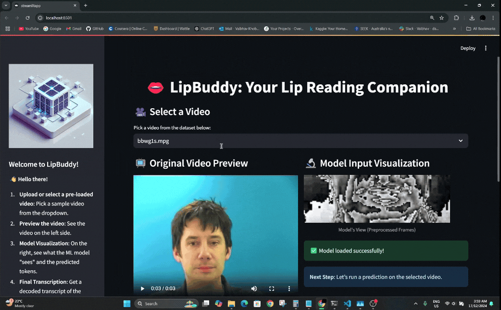

# LipBuddy: AI-Powered Lip Reading System


LipBuddy is a deep learning-based lip reading system that converts silent lip movements into readable text.


The project combines Computer Vision, Deep Learning, and Natural Language Processing techniques to recognize speech from video sequences without relying on audio input.


---


## Project Overview


This system processes video frames of a speaker's mouth region and predicts the spoken words using a trained LipNet-inspired neural network.


The application provides:


- Video selection interface

- Real-time visualization of mouth movements

- Deep learning-based prediction

- Decoded text output

- Interactive Streamlit interface


---


## Features


- Automatic video preprocessing

- Lip region extraction

- Deep learning inference

- Sequence prediction using trained weights

- Interactive Streamlit application

- Visual prediction output

- Sample video testing


---


## Technologies Used


- Python

- TensorFlow

- OpenCV

- NumPy

- Streamlit

- Deep Learning

- Computer Vision


---


## Project Structure


```text

lip-reading-system/

│

├── streamlitapp.py

├── modelutils.py

├── utils.py

├── requirements.txt

│

├── models/

│   └── new\_best\_weights2.weights.h5

│

├── sample\_data/

│   └── test\_video.mp4

│

├── screenshots/

│   ├── interface.png

│   └── prediction.gif

│

├── notebooks/

│   └── lipnet-gpu.ipynb

│

└── docs/

```


---


## How It Works


1. Load a video sequence.

2. Extract mouth region frames.

3. Preprocess frames.

4. Feed frames into the trained LipNet model.

5. Generate token predictions.

6. Decode predictions into readable text.

7. Display results through the Streamlit interface.


---


## Screenshots


### Application Interface





### Prediction Visualization


---


## Installation


Clone the repository:


```bash

git clone https://github.com/YOUR\_USERNAME/lip-reading-system.git

```


Install dependencies:


```bash

pip install -r requirements.txt

```


Run the application:


```bash

streamlit run streamlitapp.py

```


---


## Dataset


This project was trained using a lip-reading video dataset.


Due to dataset size and licensing limitations, the training dataset is not included in this repository.


---


## Future Improvements


- Real-time webcam lip reading

- Transformer-based architectures

- Arabic lip reading support

- Improved decoding accuracy

- Cloud deployment

- Multi-language support


---


## Author


Abdulkader Kharrat


AI & Computer Vision Developer


GitHub: https://github.com/AbdulkaderKharrat

